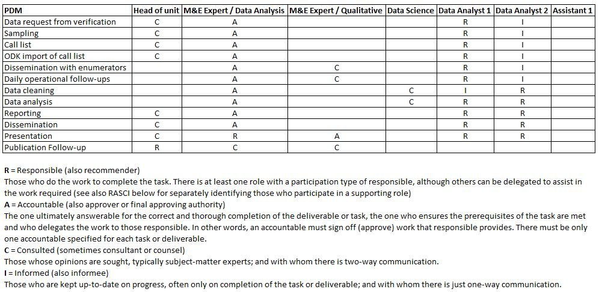

# Extras

##    Team Structure

In chapter 1.1, we did mention about 'division of labor'. It is a good doctrine, and can be merge with humanitarian organizations' M&E units. Building and understanding MnE team follows steps below:

-   Determining activities to conduct in your proposal and log frame.

-   Determining frequency of those activities.

-   Disaggregate each work piece (sub piece) of each activity.

-   Disaggregate workload of activities to staff with RASCI matrix.

-   Control workload, if you need more-less staff, report. So that you will have a team capacity to handle promised activities within log frame. Be careful, you need someone very skilled to tailor this step.

With help of the RASCI matrix, you can clearly track down who is responsible for which step and who is backup. Amazing tool for mapping all the activity sub-pieces, responsible of activities and agile team structure. This tool will also help you to justify each team member, increases accountability. Might also merged with scheduling, for ex; adding a column as "Time Req" and assign required time for each sub-activity; sampling-1 day, Data cleaning-3 days, analysis-5 days etc. Thus, you can map whole activity timeline.

